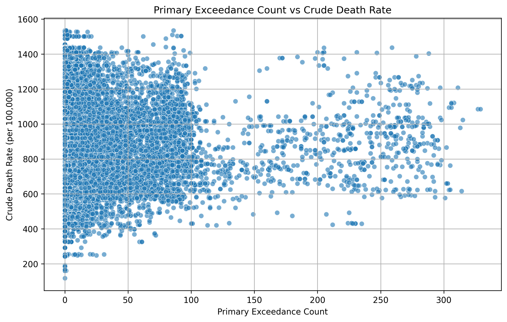
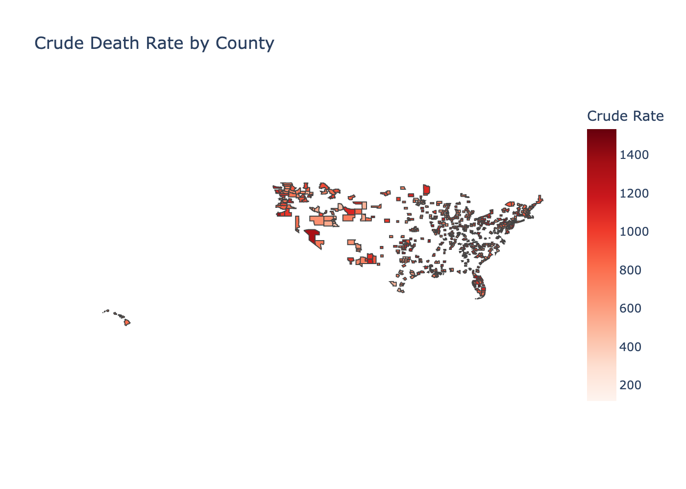
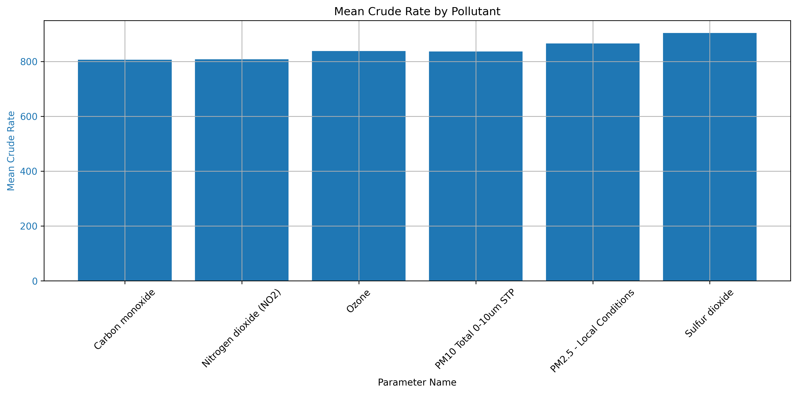
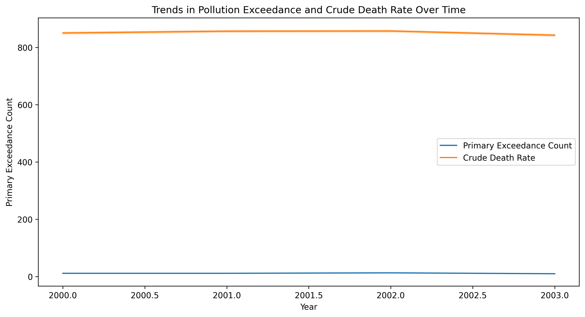

# Relationship between Air Quality and Health Outcomes

## Archived Record
Insert record here

## Contributors
- Izhaan Hussain
  - ORCID: 0009-0005-2240-8773

## Description of Research

The objective of this project is to analyze trends over time across various regions to understand the relationship between air quality and health outcomes. Specifically, the study aims to address the hypothesis:

"How do changes in air quality impact health outcomes in different areas?"

The fundamental premise is that poorer air quality adversely affects health, potentially leading to increased hospitalizations and respiratory conditions. Understanding this relationship is critical for informing public health initiatives and policy interventions. Accurate data on the impact of air quality on health outcomes enables policymakers to identify high-risk areas and implement targeted measures, such as stricter emissions regulations, public health advisories, and increased funding for healthcare infrastructure in affected regions. Healthcare providers can use this information to anticipate patient needs, offer preventive care, and design community health programs aimed at mitigating the effects of air pollution. Environmental organizations can leverage these insights to advocate for cleaner air policies, promote sustainable practices, and raise public awareness about the health risks associated with air pollution. Furthermore, this understanding can help direct resources toward vulnerable populations, such as children, the elderly, and individuals with pre-existing conditions, who are disproportionately affected by poor air quality. Ultimately, addressing air pollution through evidence-based strategies can lead to healthier communities, reduced healthcare costs, and improved overall quality of life.

We will be using the following objectives to guide our research:

- **Objective 1: The overall effect of air quality and pollutants on health ouctomes**
  - What is the overall effect certain pollutants have on health effects?
  - We will be looking at whether pollutants have an effect on health outcomes, and what type of effect.
- **Objective 2: Geographic Differences in Air Quality and Health Outcome Relationship**
  - Are there specific regions where the relationship between air quality and health outcomes is stronger?
  - The following query looks into geographic variability to assess whether there are areas that would be most susceptible to the adverse health effects of changes in air quality. This will review differences across urban, suburban, and rural areas to look at whether there is greater association between air quality and health outcomes in some places compared to others.
- **Objective 3: The impact of specific pollutants**
  - Do specific pollutants (e.g., PM2.5, NO2, O3) have a different effect on health outcomes?
  - Air quality statistics also involve different categories of pollutants. This sub-question will, therefore, investigate whether some categories of pollutants have a greater effect on health outcomes in determining which ones are most harmful to public health.
- **Objective 4: Lagged affects of air quality on health**
  - Do changes in air quality in one period (e.g., previous month or season) predict changes in health outcomes in subsequent periods?
  - It will further investigate whether the variation in air quality in one period has a lagged health consequence in another period. This project will contribute to the identification of lagged health effects caused by poor air quality.

This research, guided by the outlined objectives, aims to provide a thorough analysis of the relationship between air quality and health outcomes. By examining the overall effects of pollutants, exploring geographic differences, assessing the impact of specific pollutants, and identifying potential lagged health effects, the study seeks to offer a multi-faceted understanding of how air quality influences public health.

## Data Profile

- Centers for Disease Control and Prevention Wonder API
  - https://wonder.cdc.gov/cmf-icd10.html
- Environmental Protection Agency API
  - https://aqs.epa.gov/aqsweb/documents/data_api.html

The first dataset we selected was obtained through the CDC Wonder API. The dataset includes detailed information on deaths occurring within the U.S., categorized by demographic factors such as age, race, sex, and geographic location (state and county). The data is derived from death certificates filed in all 50 states and the District of Columbia and is coded according to the International Classification of Diseases.

This API allows users to access mortality data spanning from 1999 to the present, making it suitable for long-term trend analysis. Researchers can query the data by specific causes of death, categorized by ICD-10 codes, and filter results by parameters such as year, place of death, and population group. The dataset provides mortality rates, counts of deaths, and age-adjusted rates, enabling comprehensive epidemiological research. Since we are focusing our research on the years 2000-2003, we filtered the API to those years.

The CDC API supports public health initiatives by offering insights into patterns and trends in mortality, including causes related to chronic diseases, infectious diseases, injuries, and other health conditions. It is particularly useful for identifying health disparities across different populations and regions, as well as assessing the impact of public health policies over time. However, in order to safeguard the individuals' identities, there are restrictions in place. In compliance with the data use restrictions, we are using this data solely for analysis and are not attempting to identify any individuals within the dataset. We extracted the relevant data from the API and stored it in our "data" folder. 

The second dataset, obtained from the U.S. Environmental Protection Agency's (EPA) Air Quality System (AQS), provides extensive annual air quality data covering multiple years and regions across the United States. It contains measurements for a range of pollutants, including particulate matter (PM2.5 and PM10), ozone (O3), sulfur dioxide (SO2), nitrogen dioxide (NO2), and carbon monoxide (CO). These pollutants are tracked by numerous state and local air quality monitoring stations, offering a detailed perspective on air quality trends over time and across different areas.

Aligned with the project's goal of analyzing the relationship between health outcomes and air quality over time in various locations, this dataset is a valuable resource for understanding how changes in pollutant levels affect respiratory health and other health conditions. Covering the period from 2000 to 2003, this data supports research on pollution trends, seasonal patterns, and events influencing air quality. Insights derived from this analysis can aid in developing policies and allocating resources to reduce the adverse health impacts of air pollution. 

This data was accessed directly by the API, and since the data is classified as public domain under the EPA's license, we are permitted to use it without needing explicit permission. This data was also stored in our "data" folder for the corresponding years.

In order to merge the two datasets into one table to use for analysis, we had to do some cleaning. This included dropping the following variables from the EPA table: [ ‘Site Num', ‘Parameter Code', ‘Latitude', ‘Longitude', ‘Datum', ‘Sample Duration', ‘Pollutant Standard', ‘Metric Used', ‘Method Name','Event Type', ‘Completeness Indicator', 'Valid Day Count', ‘Required Day Count', "Null Data Count', 'Secondary Exceedance Count', "Secondary Exceedance Count', ‘Certification Indicator’, ‘Certification Indicator', ‘Num Obs Below MDL', ‘Arithmetic Mean', ‘Arithmetic Standard Dev', ‘1st Max Value','1st Max DateTime', "2nd Max Value', ‘2nd Max DateTime', ‘3rd Max Value', ‘3rd Max DateTime’, ‘4th Max Value', '4th Max DateTime', ‘1st Max Non Overlapping Value', ‘Ist NO Max DateTime', '2nd Max Non Overlapping Value', "2nd NO Max DateTime', '99th Percentile', ‘98th Percentile', ‘95th Percentile', ‘90th Percentile','75th Percentile’, ‘50th Percentile’, ‘10th Percentile', ‘Address', ‘Date of Last Change’ ]. Additionally, from the CDC table, we dropped the following columns: ['Notes', 'Year Code', ‘Crude Rate Lower 95% Confidence Interval', ‘Crude Rate Upper 95% Confidence Interval','Crude Rate Standard Error']. We also removed any rows that contained null or NaN values. This was all done using the code in scripts/clean_data.py.

We then wanted to merge the data by state code, county code, and year, however, we needed to change the format of the county codes for the EPA data to match that of the CDC. We then proceeded to merge the data which is in results/merged_data.csv.

## Findings
#### Exploratory Analysis
In order to observe basic trends and correlations in our data, we calculate some summary statistics.

Summary Statistics for Pollutants:
       Primary Exceedance Count  Observation Count  Observation Percent
count              48501.000000       48501.000000         48501.000000
mean                  11.322674        2716.996495            87.902229
std                   31.586154        3425.601606            19.424289
min                    0.000000           1.000000             0.000000
25%                    0.000000         107.000000            89.000000
50%                    1.000000         314.000000            95.000000
75%                    6.000000        5824.000000            98.000000
max                  329.000000        8779.000000           100.000000

The statistics above show some summaries for pollutants. The most notable statistics are the average primary exceedance count being 11.3 which is the number of times pollutant levels exceeded regulatory standards.

Correlation between Death Rate and Pollutant Exceedance Count:
                          Death Rate  Primary Exceedance Count
Death Rate                  1.000000                  0.029802
Primary Exceedance Count    0.029802                  1.000000

We can see that there is a slight correlation between death rate and primary exceedance count. Given the context of this, it is still a significant amount.

Number of Unique Pollutants:
6

The number of unique pollutants in our data is 6.

Frequency of Each Pollutant:
Parameter Name
PM2.5 - Local Conditions    23511
Ozone                       13604
PM10 Total 0-10um STP        4159
Carbon monoxide              2974
Sulfur dioxide               2868
Nitrogen dioxide (NO2)       1385

The most frequently recorded pollutant was PM2.5 - Local Conditions, appearing in 23,511 observations, followed by Ozone with 13,604 observations.

Average Death Rate by Pollutant:
Parameter Name
Sulfur dioxide              903.747006
PM2.5 - Local Conditions    865.521632
Ozone                       837.687016
PM10 Total 0-10um STP       836.231907
Nitrogen dioxide (NO2)      807.955560
Carbon monoxide             805.834021

Sulfur dioxide had the highest average death rate (903 per 100,000), reinforcing its significance as a health risk factor.

#### Pollutant Levels and Mortality Rates
In order to find how pollutant levels affected mortality rates, we created a scatterplot of two relevant variables. To assess pollutant levels, we used "Primary Exceedance Count" and to assess mortality rates, we used "Crude Death Rate". This results in the following plot: 

Although there is a weak positive correlation and a slight upward trend, indicating that higher exceedance counts may be associated with higher death rates, the relationship is not strong enough to draw definitive conclusions. This weak correlation implies that while pollutant exceedances contribute to health outcomes, other factors such as socioeconomic conditions, healthcare access, and underlying health conditions likely play significant roles in influencing crude death rates.

##### Geographic Distribution of Mortality
The second objective we wanted to tackle was the geographic distribution of crude death rates across US counties. This resulted in the following plot:

Higher crude death rates were observed in parts of the western and southern United States. The geographic variability suggests that different regions experience varying levels of air quality and health impacts due to factors such as population density, proximity to pollution sources, and socioeconomic disparities.

This spatial analysis highlights the importance of region-specific policies and interventions to address air quality issues effectively. Regions with higher death rates may require increased healthcare resources, stricter pollution controls, and targeted public health campaigns to mitigate adverse health effects.

#### Mean Crude Rate by Pollutant
In order to find which pollutants had the biggest effect on crude death rate, we created a bar chart to visualize this:

Sulfur dioxide and PM2.5 - Local Conditions were associated with the highest mean crude death rates, while Carbon monoxide and Nitrogen dioxide (NO2) were linked to comparatively lower crude rates. These results suggest that certain pollutants, particularly Sulfur dioxide and PM2.5, may pose a higher risk to public health and contribute more significantly to adverse health outcomes compared to others. This finding underscores the need for targeted interventions to reduce emissions of these harmful pollutants.

#### Trends Over Time
In order to see whether there are lagged effects of pollutants on health outcomes, we created a line chart showing "Primary Exceedance Count" and "Crude Death Rate":

The chart shows relativelt stable patterns. This suggests that although there are fluctuations, there may not be immediate impacts on death rates within short time frames. It also raises the possibility that long-term exposure to even low levels of pollutants can have cumulative health effects.

## Future Work

## Reproducing

## References